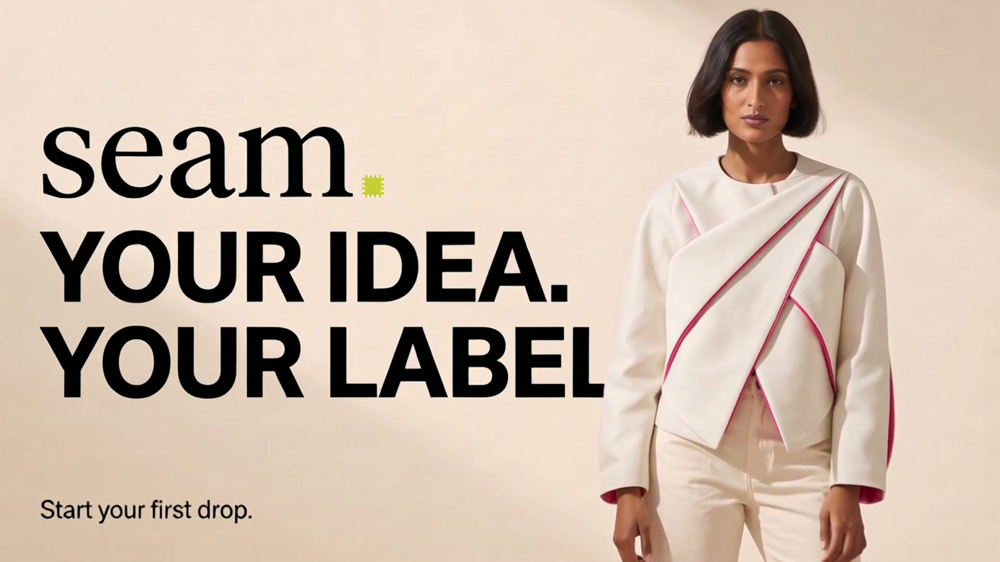

# Visual Thinking

Turn product ideas and real interfaces into visual concepts before you build.

Visual Thinking is an agent skill for generating images, inspecting the actual result, and making focused revisions. It also covers short launch films built from clear visual states instead of asking a video model to invent the whole story at once.

[](https://github.com/Warlord-K/visual-thinking/releases/download/v0.1.0/seam-studio.mp4)

[Watch the 30-second Seam Studio film](https://github.com/Warlord-K/visual-thinking/releases/download/v0.1.0/seam-studio.mp4)

## What it does

- Turns a rough idea into one image or a coherent set of screens.
- Inspects generated work before deciding what to change.
- Preserves real product details when screenshots are the source.
- Plans empty, action, and result states for motion.
- Builds launch films from short generated clips and a clean final edit.

## Install

Clone the repository:

```bash
git clone https://github.com/Warlord-K/visual-thinking.git
cd visual-thinking
```

Copy `skills/visual-thinking` into the skills directory used by your agent.

For Codex, run this from the cloned repository:

```bash
destination="$HOME/.agents/skills/visual-thinking"
if [ -e "$destination" ]; then
  echo "visual-thinking is already installed at $destination"
  exit 1
fi
mkdir -p "$(dirname "$destination")"
cp -R skills/visual-thinking "$destination"
```

Codex detects newly installed skills while it is running. Restart it only if the skill does not appear. The existing-directory check prevents an accidental overwrite. Remove or rename the installed folder yourself before installing a newer copy. See the [Codex skills guide](https://learn.chatgpt.com/docs/build-skills) for more installation options.

## Try it

```text
Use visual-thinking to create four coherent screens for a chibi online chase game: home, lobby, match, and pause menu. Inspect every image and fix only the clearest misses.
```

```text
Use visual-thinking to plan a 30-second launch film for my existing product. Inspect the public site first, preserve its real copy and interface, then design six short motion beats.
```

```text
Use visual-thinking to explore three landing-page directions for this product. Show one direction at a time and explain what the generated image actually proves.
```

## Tools

The method works with any suitable image and video tools. The Seam Studio example used these fal model endpoints:

- `fal-ai/nano-banana-2` for generated keyframes
- `fal-ai/nano-banana-2/edit` for reference-based image edits
- `minimax/h3-max/image-to-video` for motion
- `minimax/music-3` for instrumental music
- FFmpeg for the final edit and export

You need access to the models you choose and a working FFmpeg installation if you want to assemble a film. Provider limits, formats, and availability can change.

## Seam Studio example

Seam Studio is a concept product where an independent designer sketches an original garment, creates a refined version, prepares a small preorder campaign, and publishes a storefront. The example uses seven keyframes and six five-second motion clips. The interface, campaign details, and garment are concept material.

Read [the Seam Studio breakdown](skills/visual-thinking/references/seam-studio.md) for the storyboard, reconstructed prompt recipes, and editing notes.


## Ground rules

Inspect every generated image and rendered video. Describe only what is visible. Do not present generated UI as working software or a published workflow card as proof that a real job ran.

For an existing product, treat screenshots as the source of truth. Remove private data before sending captures to a model provider, and keep original captures separate from edited presentation frames.

## Author

By [Yatharth Gupta](https://yatharth.ai). GitHub: [Warlord-K](https://github.com/Warlord-K).
