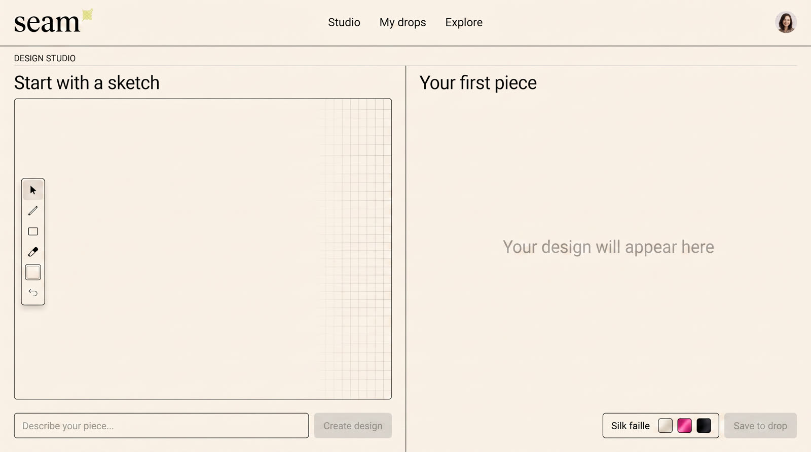
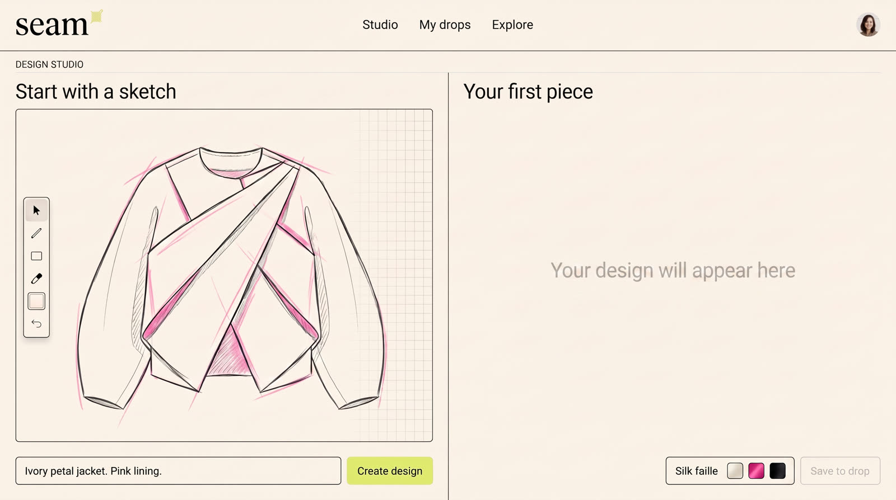
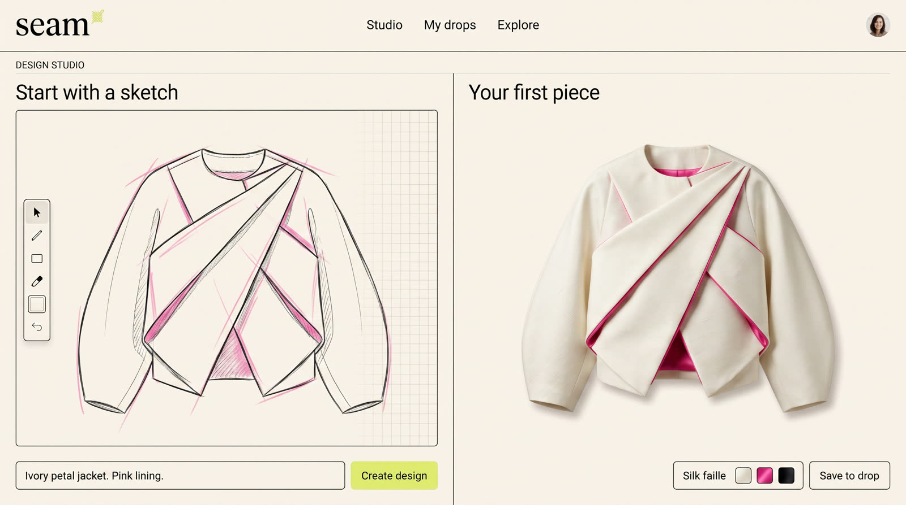

# Seam Studio example

Seam Studio is a concept fashion product. An independent designer sketches an original garment, creates a refined version, prepares a small preorder campaign, and publishes a storefront.

The finished film is 30 seconds. It uses seven keyframes and six motion clips. Each clip contributes five seconds to the edit.

## Storyboard

| Time | Visual beat |
| --- | --- |
| 0:00 | An empty studio becomes a petal-panel jacket sketch through visible drawing. |
| 0:05 | Create activates, the interface shows a generation state, and the sculptural ivory jacket appears. |
| 0:10 | The camera moves into the pink lining, REMIX lands, and alternate colorways appear. |
| 0:15 | DROP leads into a small preorder campaign. |
| 0:20 | Launch moves from the campaign into the customer storefront. |
| 0:25 | A moving model wears the final jacket beside YOUR IDEA. YOUR LABEL. |

## Keyframe plan

The seven states were:

1. Empty design studio
2. Garment sketch
3. Finished studio result
4. Material and color refinement
5. Preorder campaign
6. Customer storefront
7. Closing model and title

The key detail was temporal separation. The first image had empty sketch and output areas. The drawing appeared in the next state. The finished garment appeared only after the Create action. This gave the video model a real transformation to animate.

| Empty studio | Sketch | Finished result |
| --- | --- | --- |
|  |  |  |

## Reconstructed image prompt recipes

These recipes describe the method used for the example. They are reconstructions, not the original prompts.

### Empty studio

```text
Create a polished widescreen concept for an independent fashion design studio. Use an editorial cream and charcoal interface with one warm pink accent. Show an empty drawing canvas on the left and an empty garment result area on the right. Include a clear Create control, but do not show a sketch or finished garment. Keep the camera, panel geometry, type scale, and lighting suitable for matching later states.
```

### Sketch state

```text
Use the empty studio as the layout reference. Preserve the interface, camera, and empty result area. Add an original hand-drawn jacket sketch to the drawing canvas: sculptural ivory petal panels, cocoon sleeves, asymmetric closure, and a glimpse of pink lining. The garment must remain a sketch. Do not place a finished product in the result area.
```

### Finished result

```text
Use the sketch state as the reference. Preserve the studio shell and drawing. Show a refined physical jacket only in the result area, matching the ivory folded panels, cocoon sleeves, asymmetric closure, and pink lining. Make the result feel newly created and keep the visible copy short.
```

### Campaign and storefront

```text
Carry the same original jacket and visual language into a small preorder campaign, then a clean customer storefront. Preserve the garment silhouette, materials, and pink lining. Use restrained concept copy and avoid claims about real manufacturing, delivery, sales, or product availability.
```

### Closing frame

```text
Create a fashion launch closing frame with a model wearing the same jacket. Use a clean full-body composition with room for the exact title YOUR IDEA. YOUR LABEL. Keep the model's stance and fabric able to move naturally during a five-second hold.
```

## Reconstructed motion prompt recipe

Each motion request described one clear action and its order. A typical request followed this shape:

```text
Begin exactly from the supplied first image. Immediately animate [specific action]. Make [visible cause] happen before [result]. Reach the supplied ending state with enough time left to read it. Preserve the garment design and main interface geometry. Keep natural motion in the subject and fabric after the camera settles. Avoid early reveals, frozen holds, new interface elements, and unreadable text.
```

The promotional beats allowed stronger camera movement and large type. The functional Create beat used a steadier camera so the click, generation state, and result stayed clear.

## Model and edit notes

- Keyframes used `fal-ai/nano-banana-2` through fal.
- Motion used `minimax/h3-max/image-to-video` through fal.
- Music used `minimax/music-3` through fal.
- The edit used six full-bleed clips with hard cuts at five-second intervals.
- Generated clip audio was removed before the music was added.
- The final export was 1920 by 1080, 30 fps, H.264 video, and AAC stereo audio.

The video model returned slightly more than five seconds per request in this run. The edit used the first continuous five seconds from each clip. It did not clone, freeze, or loop frames to fill time.

## What to inspect

- The sketch appears before the finished garment.
- Create visibly causes the result.
- The same garment remains recognizable across refinement, campaign, storefront, and closing scenes.
- Large title beats remain legible.
- The closing model and fabric keep moving during the final hold.
- Generated interface details are described as illustrative.
- Transient text distortion is treated as a limitation of generated motion.

The film is concept material. It does not claim a working Seam Studio product, real manufacturing, fulfilled orders, or campaign results.
